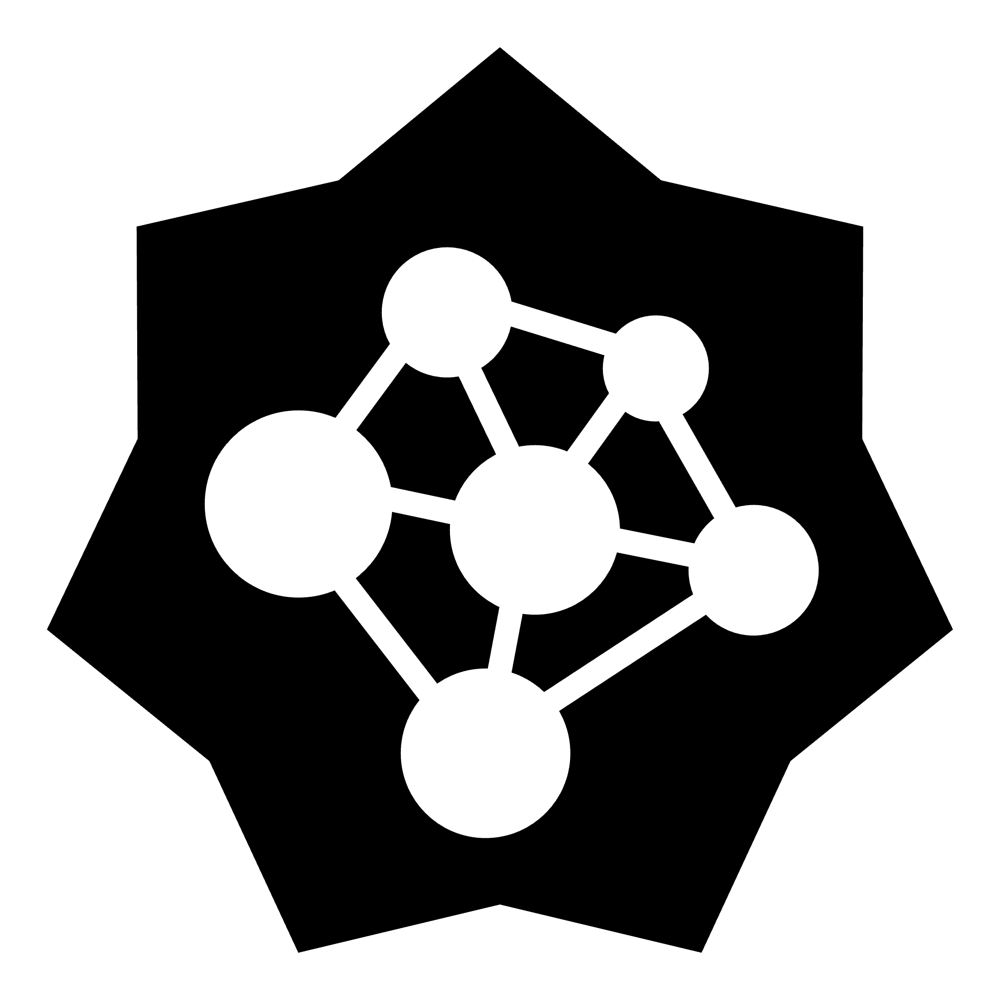
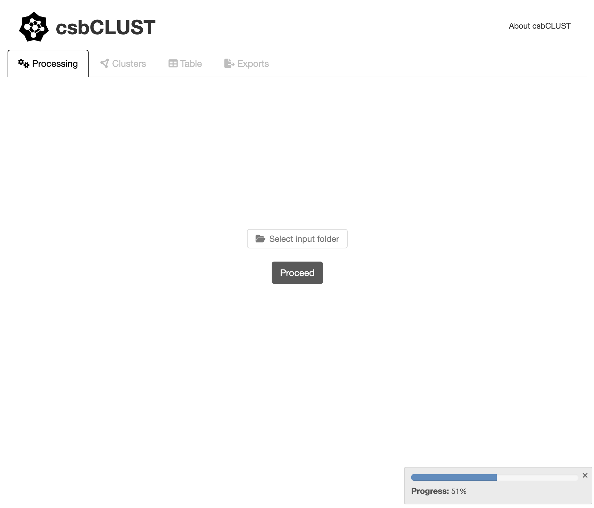
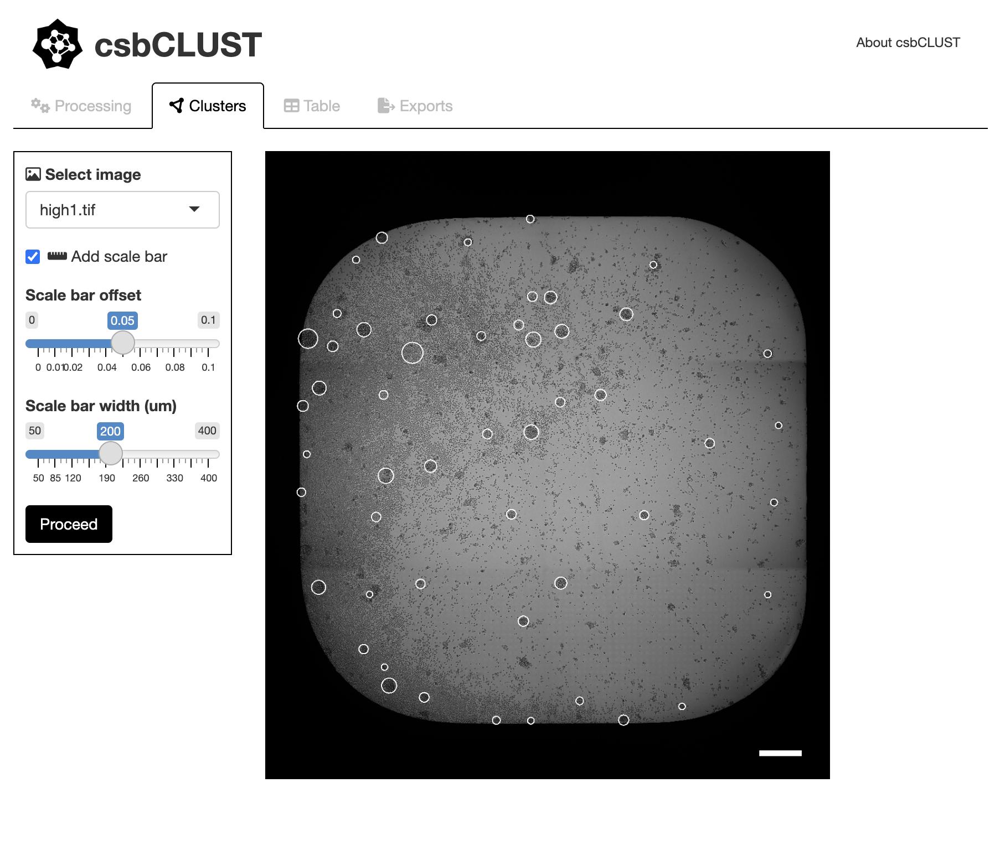
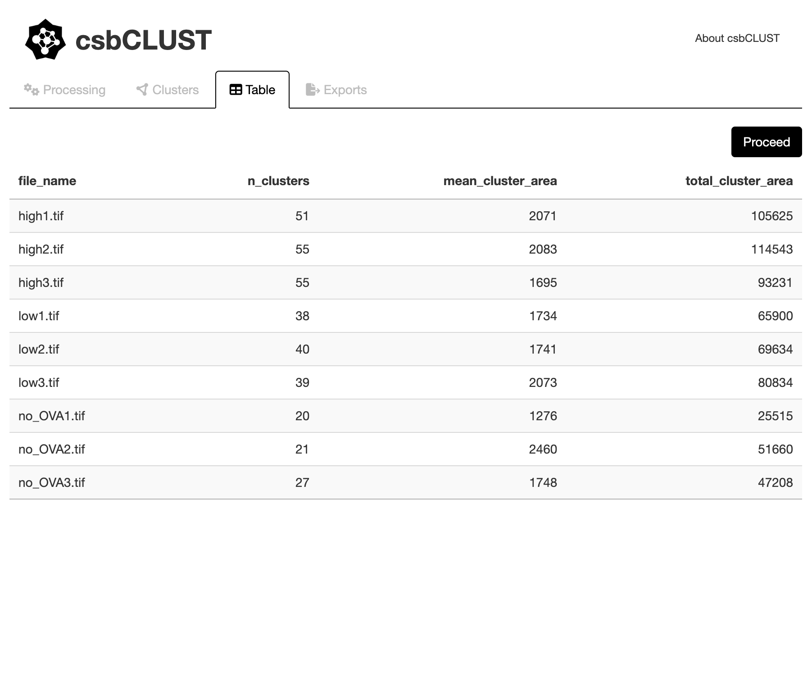
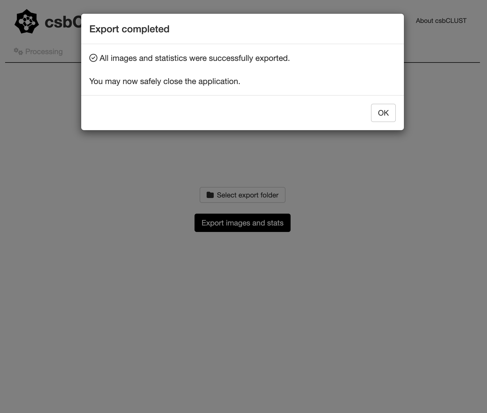

<!-- README.md is generated from README.Rmd. Please edit that file -->

# csbCLUST 

<!-- badges: start -->
<!-- badges: end -->

**csbCLUST** is an open-source R package that provides an interactive,
Shiny-based application for automated detection, quantification, and
export of cellular clusters from brightfield microscopy images.

The software has been specifically optimised for brightfield images
acquired on widefield microscopes using black 384-well plates, where
robust discrimination of true cellular clusters from well edges,
corners, and illumination artefacts is required.

---

## Installation

**csbCLUST** depends on Bioconductor packages for image processing.
Before installation, ensure that **Bioconductor** is available.

    # install Bioconductor manager if needed
    install.packages("BiocManager")

    # install required Bioconductor dependency
    BiocManager::install("EBImage")

    # install devtools if needed
    install.packages("devtools")

    # install csbCLUST from GitHub
    devtools::install_github("BonilhaCaio/csbCLUST")

---

## Usage

The **csbCLUST** Shiny application is launched through a single function:

    csbCLUST::runCsbCLUST()

This command opens the interactive graphical user interface in a web
browser or RStudio viewer.

---

## User Guide

**csbCLUST** is launched as an interactive Shiny application for
automated cluster detection and quantification from brightfield
microscopy images.

The workflow is organised into sequential tabs that guide the user from
image selection to result export. Tabs are activated progressively to
enforce a logical analysis order and reduce user error.

- The application opens in the *Processing* tab, where the user selects
  a folder containing brightfield microscopy images (`.tif` or `.tiff`).
  Once a valid folder is selected, automated cluster detection is
  performed across all images. A **progress bar** provides real-time
  feedback during processing, reflecting the multi-stage image analysis
  pipeline applied to each image.

- After processing, the *Clusters* tab allows visual inspection of
  individual images. Detected clusters are overlaid as circular outlines
  on the original brightfield image. Users may optionally add a
  calibrated scale bar and adjust its width and position to aid visual
  interpretation.

- The *Table* tab presents a quantitative summary of cluster metrics for
  each processed image, including the number of detected clusters, mean
  cluster area, and total cluster area per image.

- In the final *Exports* tab, the user selects an output directory and
  exports all results in a single step. The export process generates a
  global summary `.csv` file, per-image `.png` files with detected
  clusters and optional scale bars, and per-image `.csv` files
  containing cluster geometry. A confirmation dialog is displayed upon
  successful completion.

---

## Credits and citation

A publication describing the methodology and software implementation is
in preparation. In the meantime, **csbCLUST** can be cited as:

    citation("csbCLUST")
